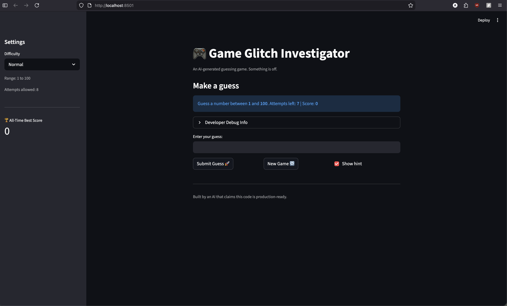
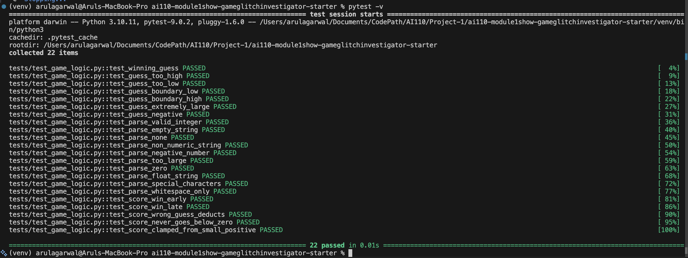

# 🎮 Game Glitch Investigator: The Impossible Guesser

## 🚨 The Situation
You asked an AI to build a simple "Number Guessing Game" using Streamlit. It wrote the code, claimed it was "production-ready," and then disappeared. In reality, the game was a mess: the hints lied, the score went negative, and the secret number changed every single time you made a guess.

## 🛠️ Setup
1. **Activate Environment:** `source venv/bin/activate`
2. **Install dependencies:** `pip install -r requirements.txt`
3. **Run the app:** `python -m streamlit run app.py`

## 🕵️‍♂️ Mission Objective
The goal was to diagnose, refactor, and repair this broken AI-generated code. I successfully decoupled the game logic from the UI, fixed state management issues, and verified the entire system with a robust automated testing suite.

## 📝 Document Your Experience

### The Bugs I Found
* **The "Commitment Issue" (State Bug):** The secret number was being re-generated on every rerun, making it impossible for a user to ever win.
* **Reversed Hint Logic:** The game incorrectly told users to "Go Lower" when their guess was already below the secret number.
* **Negative Scoring:** The score lacked a floor, allowing it to drop into negative integers indefinitely.
* **Input Vulnerability:** The game accepted strings, special characters, and numbers outside the 1-100 range, wasting user attempts.

### The Fixes I Applied
* **Session State Management:** Implemented `st.session_state` to persist the secret number, score, and guess history across reruns.
* **Logic Refactoring:** Moved all core game mechanics into `logic_utils.py` to ensure the code is modular, testable, and clean.
* **Input Validation:** Created a robust `parse_guess` function that validates types and ranges before processing.
* **Automated Testing:** Developed a suite of 22 tests using `pytest` to cover every edge case from empty strings to extreme boundary values.

## 📸 Demo

### Enhanced Game UI & High Score Tracker
I upgraded the UI with color-coded hints (Red for High, Yellow for Low, Green for Win), proximity emojis (Hot/Cold), and a persistent All-Time Best Score metric in the sidebar.

### Automated Test Suite
All 22 test cases—covering game logic, score clamping, and input parsing—are passing successfully.

## 🚀 Stretch Features Completed
* **Challenge 1: Advanced Edge-Case Testing** — Added 19 additional tests for malformed inputs and boundary conditions.
* **Challenge 2: Feature Expansion** — Implemented a persistent High Score tracker using `highscore.json`.
* **Challenge 3: Professional Documentation** — Added NumPy-style docstrings and PEP-8 compliant formatting to all modules.
* **Challenge 4: Enhanced Game UI** — Integrated a sortable Guess History dataframe and proximity-based feedback.
